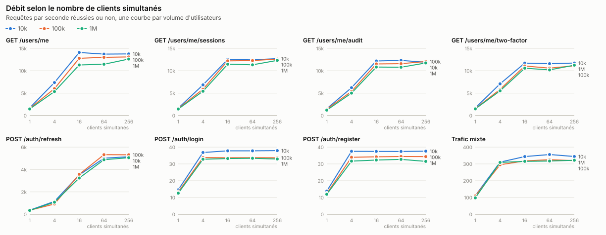
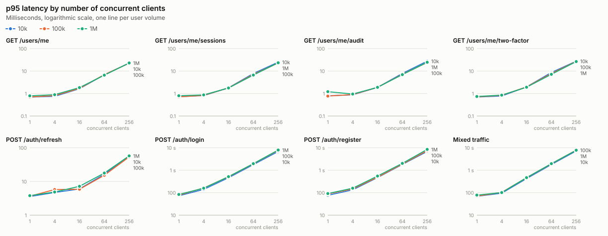
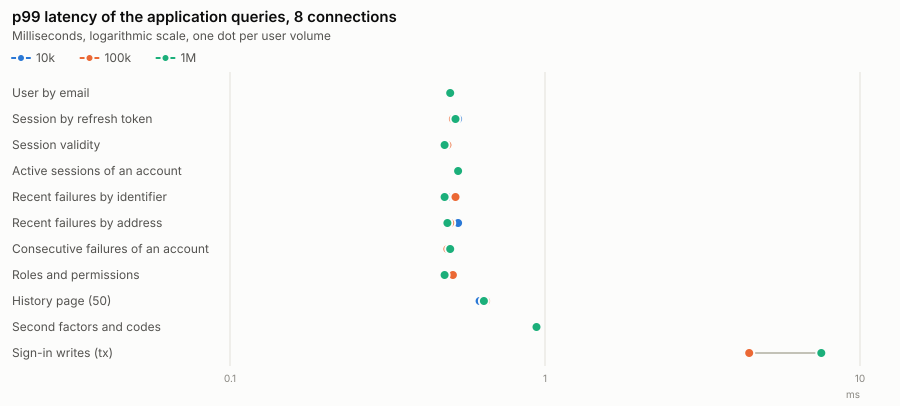
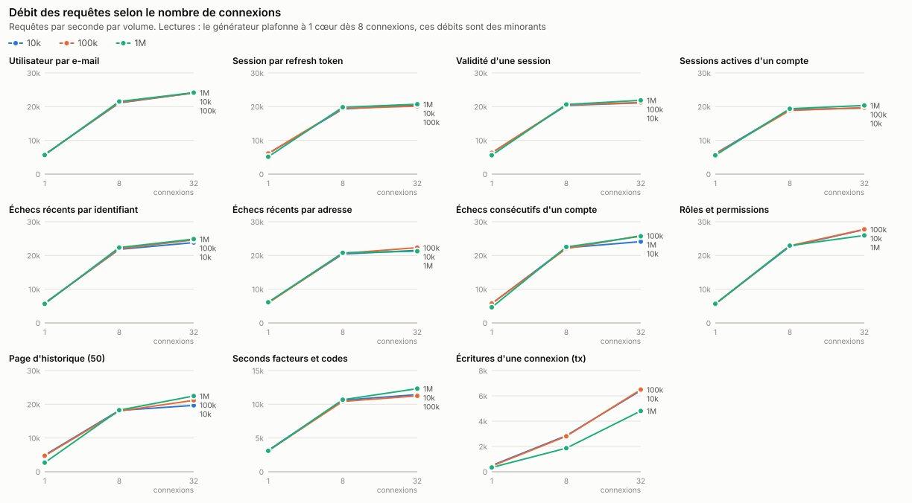

# Performance report - database and API

Campaign of 15 September 2026, commit `3ac984d`. Raw data:
[`data.md`](data.md); protocol and limits below. The recommendations have
been applied and measured again: see
[section 6](#6-follow-up-on-the-recommendations).

## Summary

1. **The number of accounts has little effect on the calls.** From 10 000 to
   1 000 000 accounts (database from 109 MB to 10.5 GB), the maximum throughput
   of authenticated calls drops by 2 to 10% and their p95 latency at equal load
   does not move (1.6 → 1.8 ms at 16 clients on `GET /users/me`). Every query
   on the hot path remains an index scan: 0.01 to 0.04 ms on the database side
   at 1 million accounts.
2. **The limiting component is the API CPU, not the database.** On
   authenticated reads, the API saturates its 3 cores from 16 clients
   (11 000 to 14 000 req/s) while PostgreSQL uses only 1.3 to 1.9 of its 3
   cores. Beyond that, additional clients only wait: p95 of 1.8 ms at 16
   clients, 7 ms at 64, 23 ms at 256.
3. **Sign-ins size the service.** Argon2id caps the throughput of `login` and
   `register` at 33-38 req/s on 3 cores (≈ 90 ms of computation per hash).
   At 256 concurrent sign-ins, each one waits 7 to 8 seconds. This computation
   is well isolated: in mixed traffic at 256 clients, the profile answers in
   0.8 ms (p50) and refresh in 4.1 ms while the sign-ins wait.
4. **Refresh plateaus around 5 000 req/s, limited by PostgreSQL** (2.5 to 2.6
   cores out of 3: one write transaction with synchronous commit per call),
   whatever the volume.
5. **Only writes degrade with volume.** At 1 million accounts, the sign-in
   transaction loses 25 to 35% of its throughput (6 422 → 4 805 tx/s at
   32 connections, p99 8.2 → 11 ms) and reads 11 400 blocks per second from
   disk: the database outgrows the memory allocated to it, and updating indexes
   with random keys (token hash, UUID) becomes a matter of I/O.
6. **Two fixes stand out**: the session purge costs 0.7 to 2.3 s per batch of
   5 000 rows at 1 million accounts (it rereads the whole backlog on every
   batch), and nearly 900 MB of indexes never used by the application slow
   down every write.

## 1. What was measured

**Question:** how do the database and the API calls behave as the number of
accounts grows and as the load increases?

Two axes, crossed:

| Axis | Values |
|------|--------|
| Data volume | 10 000, 100 000 and 1 000 000 accounts, with the history an account accumulates |
| Load | 1, 4, 16, 64 and 256 concurrent clients (HTTP); 1, 8 and 32 connections (SQL) |

Three families of measurements at each volume:

1. **HTTP calls** end to end, per scenario and in mixed traffic:
   throughput, p50/p95/p99/max latencies, errors, CPU consumed by each component.
2. **Application queries** run directly on PostgreSQL through the repository
   functions (the same SQL as the API, as prepared statements): throughput and
   latency by number of connections.
3. **Database state**: actual execution plans (`EXPLAIN ANALYZE, BUFFERS`),
   table and index sizes, `pg_stat_statements` statistics during mixed
   traffic, duration of purge batches.

## 2. Protocol

### Machine and isolation

- QEMU virtual machine, 8 vCPUs ("QEMU Virtual CPU version 2.5+"),
  23.4 GB of memory, SSD disk, Debian 13 (kernel 6.12).
- PostgreSQL 17.11, measured commit `3ac984d`.
- Campaign of 15 September 2026, from 09:52 to 11:18, seeding included
  (9 minutes to grow from 100 000 to 1 000 000 accounts).

Everything runs on the same virtual machine. So that the components do not
steal CPU time from each other and the consumption of each one can be
measured, each is pinned to its own cores:

| Cores | Component |
|-------|-----------|
| 0-2 | PostgreSQL |
| 3 | Redis and NATS |
| 4-6 | API (`auth-api`, release build) |
| 7 | Load generator |

The CPU consumption of each component is read from `/proc/stat` on its cores
during the measurement window.

### Configuration

- **PostgreSQL 17** on disk (SSD), with production durability:
  `fsync`, `synchronous_commit` and `full_page_writes` enabled.
  `shared_buffers=4GB`, `effective_cache_size=12GB`, `work_mem=16MB`,
  `random_page_cost=1.1`, `max_wal_size=8GB`, `pg_stat_statements` and
  `track_io_timing`.
- **Redis** without persistence, **NATS** with JetStream on disk.
- **API** in release build, PostgreSQL pool of 32 connections and Redis pool of
  32. **Argon2id with production parameters** (64 MiB, 3 iterations,
  4 lanes), limited to the 3 cores of the API.
- The **rate limiter stays enabled** (its cost is part of every request), but
  its limits are raised so that it rejects nothing. CAPTCHA is disabled, the
  lockout threshold raised, and logging set to `warn`.
- Emails go to a local Mailpit.

### Data

The data set is deterministic and grows in steps (the 100 000 accounts
include the first 10 000). Per account:

| Data | Quantity |
|------|----------|
| Active sessions | 2 |
| Expired or revoked sessions | 3 (past the purge delay) |
| Sign-in attempts over 90 days | 10, including 2 failures |
| Audit entries over 25 days | 15 |
| Used email verification token | 1 |
| TOTP and 10 recovery codes | 1 account in 5 |
| Email second factor | 1 account in 20 |
| Used password reset token | 1 account in 10 |

At 1 000 000 accounts: 5 million sessions, 10 million sign-in attempts and
15 million audit entries. All accounts share the same Argon2id hash computed
with the production parameters, so verifying a password costs what it costs
in production.

### Load generator

- **Closed loop**: each virtual client sends its next request as soon as the
  previous one has answered, without pause. The measured throughput is
  therefore the maximum the system sustains at that concurrency, and the
  latency is the one a waiting client sees. It is not a fixed-rate test.
- **Access tokens**: up to 100 000 tokens signed in advance for accounts drawn
  uniformly, which makes misses in the session validity cache realistic.
- **Client addresses**: each request comes from an address drawn among
  262 144, so that per-address budgets behave as they would with real
  traffic.
- **Refresh**: each virtual client signs in once before the clock starts, then
  follows its own rotation chain.
- **Measurement**: 5 seconds of warm-up then 20 seconds of measurement per HTTP
  point (3 + 10 seconds per SQL point). Redis is flushed before each HTTP point.
  Latencies go into a histogram with 1% resolution.

### HTTP scenarios

| Scenario | Call | What it exercises |
|----------|------|-------------------|
| `profile` | `GET /users/me` | Token check (Redis), account read |
| `sessions` | `GET /users/me/sessions` | Active sessions of an account |
| `audit` | `GET /users/me/audit?limit=50` | History, partitioned table |
| `two_factor` | `GET /users/me/two-factor` | Second factors and remaining codes |
| `refresh` | `POST /auth/refresh` | Refresh token rotation (transaction), token issuance |
| `login` | `POST /auth/login` | Argon2id, anti-brute-force counters, sign-in writes |
| `register` | `POST /auth/register` | Argon2id, account creation, email |
| `mixed` | all | 50% refresh, 20% profile, 10% sessions, 5% audit, 5% 2FA, 8% sign-ins, 2% registrations |

The mix of the mixed traffic reflects a real authentication service: resource
servers verify access tokens locally (JWKS), so the API mostly sees refreshes,
then account pages, then sign-ins.

### Measured SQL queries

| Query | Used by |
|-------|---------|
| User by email | Sign-in |
| Session by refresh token | Refresh |
| Session validity | Every authenticated request, on cache miss |
| Active sessions of an account | `GET /users/me/sessions` |
| Recent failures by identifier, by address | Sign-in (anti-brute-force) |
| Consecutive failures of an account | Failed sign-in (lockout) |
| Roles and permissions | Issuance of every access token |
| History page | `GET /users/me/audit` |
| Second factors and codes | `GET /users/me/two-factor` |
| Sign-in writes | Session, account, attempt and audit in one transaction |

## 3. Results

### 3.1 Capacity at 1 million accounts

| Call | Maximum throughput | Reached at | p95 at 16 clients | Limiting component |
|------|-------------------:|-----------:|------------------:|--------------------|
| `GET /users/me` | 12 620 req/s | 16 clients | 1.8 ms | API CPU (2.98 / 3 cores) |
| `GET /users/me/sessions` | 12 315 req/s | 16 clients | 1.8 ms | API CPU |
| `GET /users/me/audit` | 11 745 req/s | 16 clients | 1.9 ms | API CPU |
| `GET /users/me/two-factor` | 11 247 req/s | 16 clients | 1.9 ms | API CPU |
| `POST /auth/refresh` | 5 055 req/s | 64 clients | 7.2 ms | PostgreSQL (2.6 / 3 cores) |
| `POST /auth/login` | 33 req/s | 4 clients | 517 ms | Argon2id (API CPU) |
| `POST /auth/register` | 33 req/s | 4 clients | 549 ms | Argon2id (API CPU) |
| Mixed traffic | 322 req/s | 4 clients | 468 ms | Argon2id (10% of the traffic) |

No errors across the 120 HTTP points of the campaign, up to 256 concurrent
clients. The load generator never exceeded 0.51 core: the ceilings are indeed
those of the server.

Mixed traffic plateaus low because it runs in a closed loop: the 10% of
sign-ins and registrations tie up the virtual clients for hundreds of
milliseconds. Its value lies elsewhere: it shows that fast calls are not
penalized by the waiting sign-ins.

| Mixed traffic, 1M accounts, 256 clients | req/s | p50 | p95 |
|-----------------------------------------|------:|----:|----:|
| refresh | 156 | 4.1 ms | 10.7 ms |
| profile | 66 | 0.81 ms | 5.6 ms |
| sessions | 31 | 0.87 ms | 5.7 ms |
| sign-in | 27 | 7.7 s | 7.8 s |

### 3.2 Effect of the number of accounts



| Metric | 10 000 | 100 000 | 1 000 000 | Change |
|--------|-------:|--------:|----------:|-------:|
| Database size | 109 MB | 1.3 GB | 10.5 GB | x97 |
| `GET /users/me`, maximum throughput | 14 086 | 13 096 | 12 620 req/s | -10% |
| `GET /users/me`, p95 at 16 clients | 1.6 ms | 1.7 ms | 1.8 ms | +0.2 ms |
| `GET /users/me/audit`, maximum throughput | 12 306 | 12 067 | 11 745 req/s | -5% |
| `POST /auth/refresh`, maximum throughput | 5 139 | 5 324 | 5 055 req/s | -2% |
| `POST /auth/login`, maximum throughput | 38 | 34 | 33 req/s | -13% |
| `POST /auth/login`, p50 at 1 client | 69 ms | 76 ms | 80 ms | +11 ms |
| Sign-in transaction, 32 connections | 6 422 | 6 493 | 4 805 tx/s | -25% |
| Sign-in transaction, p99 at 32 connections | 8.2 ms | 8.0 ms | 11.0 ms | +2.8 ms |

Reads barely slow down: a lookup in a B-tree index costs one more level when
the table grows a hundredfold, and the pages that matter stay in memory (cache
hit ratio of 99.8 to 100% from 16 clients).

Writes, however, do slow down at 1 million accounts. During mixed traffic,
`pg_stat_statements` shows inserts into `sessions`, `login_attempts` and
`audit_log` going from 0.1 ms to 0.4-0.56 ms on average, with block reads on
every call. The database (10.5 GB, of which 5.6 GB are indexes) exceeds the
4 GB of `shared_buffers`, and each insert updates indexes whose keys are
random (token hash, UUID): the page to modify is rarely in memory.

The drop in sign-in throughput (-13%) does not come from the database:
PostgreSQL uses only 0.1 core there, and it is the Argon2id computation itself
that goes from about 79 to 90 ms per hash. Unverified hypothesis: Argon2id is
bound by memory bandwidth (64 MiB per hash), which inside the virtual machine
is shared with the 10 GB of database cache.

### 3.3 Effect of load



Every call follows the same pattern, whatever the volume:

- **Up to the ceiling**, throughput grows almost linearly with the number of
  clients and latency stays stable (0.7 to 1.8 ms for reads).
- **At the ceiling**, throughput stops moving and latency grows in proportion
  to the number of clients: each one waits its turn. For reads, p95 goes from
  1.8 ms (16 clients) to 7 ms (64) then 23 ms (256).
- **No collapse**: throughput at 256 clients is equal to or higher than at
  64 clients, with no errors and no timeouts.

For sign-ins, the ceiling is reached at 4 clients (3 cores, 3 hashes at a
time): p95 of 158 ms at 4 clients, 517 ms at 16, 2 s at 64 and 7.9 s at 256.

### 3.4 Where the CPU time goes

Average cost of one call at the ceiling, at 1 million accounts (cores consumed
divided by throughput):

| Call | API | PostgreSQL | Redis + NATS |
|------|----:|-----------:|-------------:|
| `GET /users/me` | 0.24 ms | 0.12 ms | 0.05 ms |
| `GET /users/me/audit` | 0.25 ms | 0.15 ms | 0.05 ms |
| `GET /users/me/two-factor` | 0.26 ms | 0.16 ms | 0.05 ms |
| `POST /auth/refresh` | 0.44 ms | 0.51 ms | 0.06 ms |
| `POST /auth/login` | 90 ms | 3 ms | 0.3 ms |
| `POST /auth/register` | 93 ms | 3 ms | 0.3 ms |

On an authenticated call, the API spends twice as much CPU as the database:
verifying the ES256 signature of the token, the rate limiter and serialization
weigh more than the SQL query. A refresh costs twice as much, split evenly
between the API (signing a new token) and PostgreSQL (session lock, rotation,
insert, roles and permissions in one transaction).

Breakdown of SQL time during mixed traffic at 1 million accounts:

| Query | Share of SQL time | Mean |
|-------|------------------:|-----:|
| Session insert (refresh) | 15% | 0.12 ms |
| Session insert (sign-in) | 13% | 0.56 ms |
| Revocation of the rotated session | 12% | 0.09 ms |
| Insert into `audit_log` | 11% | 0.39 ms |
| Insert into `login_attempts` | 10% | 0.43 ms |
| Roles and permissions | 6% | 0.04 ms |

More than 60% of SQL time goes into writes, even though they are a minority
of the calls.

### 3.5 Database



**Every hot-path query uses an index at every volume** (plans in
[`data.md`](data.md#execution-plans)): 0.01 to 0.04 ms of execution at
1 million accounts, with no disk reads. From the application, a query costs
0.16 to 0.32 ms (p50, one connection), round trip and preparation included,
and stays under 0.65 ms at p99 with 8 connections (0.94 ms for second factors,
which run two queries), the same at 10 000 and at 1 million accounts.



The read throughputs in this chart **underestimate PostgreSQL**: from
8 connections, the load generator saturates its core (1.00) while PostgreSQL
uses only 1.6 to 2.1 of its 3 cores. The 19 000 to 28 000 queries per second
measured are a lower bound. The write transaction, on the other hand, is not
bound by the client (0.3 to 0.7 core): its drop at 1 million accounts is real.

The single-connection measurements of the 1M step were taken right after
seeding, with a cold cache: they show disk reads (up to 375 ms of I/O per
second for the history page) that disappear at the following points.

What the volume costs in storage:

| Table | Rows at 1M | Table | Indexes |
|-------|-----------:|------:|--------:|
| `audit_log` | 15.3 M | 1.5 GB | 2.4 GB |
| `sessions` | 6.0 M | 1.4 GB | 1.5 GB |
| `login_attempts` | 10.3 M | 1.1 GB | 1.1 GB |
| `recovery_codes` | 2.0 M | 226 MB | 443 MB |
| `users` | 1.0 M | 225 MB | 158 MB |

That is about 10 KB per account, indexes included, half of it in indexes.

**Indexes never scanned during the whole campaign**, at 1 million accounts:

| Index | Size | Purpose |
|-------|-----:|---------|
| `audit_log_*_request_id_created_at_idx` | 755 MB | Only `audit::find_by_request_id` uses it, and no route calls that function |
| `login_attempts_pkey` | 403 MB | Kept on purpose (logical replication) |
| `idx_sessions_family_created` | 330 MB | Useful: revoking a family on replay, not exercised here |
| `recovery_codes_code_hash_key` | 147 MB | Useful: sign-in with a recovery code, not exercised here |
| `idx_sessions_family_active` | 118 MB | **Unusable**: revocation filters on `revoked_at IS NULL OR compromised_at IS NULL OR ...`, which this partial index cannot serve |

### 3.6 Purge

| Job (batches of 5 000 rows) | 10k | 100k | 1M |
|-----------------------------|----:|-----:|---:|
| Expired or revoked sessions | 27-66 ms | 128-269 ms | 738-2 329 ms |
| Sign-in attempts (empty batch) | 9 ms | 93 ms | 832 ms |
| Verification and reset tokens | 4-39 ms | 7-16 ms | 9-16 ms |

The cost of a session batch grows with the backlog, not with the batch size:
`cleanup_expired_sessions` selects the candidates with a `UNION` followed by a
`LIMIT`, and deduplication forces PostgreSQL to read every candidate
(3 million at 1M accounts) before keeping 5 000. At this rate, clearing a
backlog of 3 million sessions takes more than 7 minutes of continuous
deletion.

The empty `login_attempts` batch (832 ms) is partly an artifact of the data
set: the rows were inserted account by account rather than in chronological
order, which makes the BRIN index on `attempted_at` ineffective. In
production, attempts arrive in order and the BRIN index stays selective; it
must however be checked after any bulk data import.

## 4. Estimated capacity

Based on the throughputs measured on 3 API cores, for a service with 1 million
accounts. The traffic assumptions are orders of magnitude, to be replaced with
your own:

| Assumption | Peak traffic | Measured capacity | Headroom |
|------------|-------------:|------------------:|---------:|
| 50 000 users active at the same time, one refresh every 15 minutes | 56 refresh/s | 5 055 req/s | x90 |
| Each one loads 20 account pages per hour | 280 req/s | 11 000-12 600 req/s | x40 |
| 20% of the accounts sign in during the peak hour | 56 sign-ins/s | 33 req/s | **x0.6** |

Authenticated calls and refresh leave considerable headroom. **Sign-ins are
the first saturation point**: a peak of 56 sign-ins per second requires about
5 API cores with the current Argon2id parameters, that is two instances of the
measured size to keep some headroom. Since the API is stateless, this is
solved by adding instances; each added core brings 11 to 13 sign-ins per
second and uses 64 MiB of memory per hash in progress.

## 5. Recommendations

In order of impact:

1. **Size the API for sign-ins, not for requests.** Plan for 11 to 13 sign-ins
   per second per core, `ARGON2_MAX_CONCURRENCY` equal to the number of cores
   and 64 MiB of memory per core for Argon2id. Monitor
   `argon2_queue_available_permits`: when it stays at 0 for a sustained period,
   sign-ins pile up and one more instance is needed.
2. **Bound the cost of a session purge batch.** Replace the `UNION ... LIMIT`
   of `cleanup_expired_sessions` with two independent bounded deletes (expired
   sessions, then revoked ones), each with its own `LIMIT`, in a new
   migration. The cost of a batch becomes proportional to the batch again.
3. **Drop `idx_sessions_family_active`** (118 MB at 1M, unusable), and decide
   what to do with the audit `request_id` index (755 MB at 1M, no route uses
   it): keep it only if support looks up the audit log by request identifier.
   Every removed index makes all inserts cheaper.
4. **Beyond one million accounts, give PostgreSQL enough memory for its write
   indexes.** This is the only path that degrades with volume. At 1M, the
   indexes of `sessions`, `login_attempts` and `audit_log` weigh 5 GB: aim for
   memory (`shared_buffers` and the OS cache) that holds them, or shorten the
   retention periods (90 days of attempts, 12 months of audit) that make these
   tables grow.
5. **Low priority:** the history page also scans the 12 future monthly
   partitions, which are empty (0.04 ms in total today); bounding the query to
   `created_at <= now()` would let them be excluded. Refresh, limited by
   PostgreSQL, keeps x90 headroom over the traffic assumption: no need to
   optimize it for now.

## 6. Follow-up on the recommendations

All recommendations were applied (retention functions and indexes in the migrations, code,
monitoring and documentation), then measured on the same database of
1 million accounts, before and after, under the same conditions. Writes were
measured twice on each side: the ranges show the spread between the two
passes.

| # | Recommendation | What was done | Before | After |
|---|----------------|---------------|-------:|------:|
| 1 | Size the API for sign-ins | "Capacity Planning" guide in the operations runbook; the API logs its Argon2 budget at startup and warns if the container memory limit does not cover it | - | Documented |
| 2 | Monitor Argon2 saturation | Two alerts: no free slot for 5 minutes (warning) and 15 minutes (critical) | 1 alert at 5 min | 2 levels |
| 3 | Bound the session purge | Expired then revoked sessions in two bounded deletes; every purge goes through a TID scan (`ctid = ANY (ARRAY(...))`) | 750-820 ms per batch | **24-27 ms per batch** |
| 4 | Drop `idx_sessions_family_active` | Dropped | 118 MB | 0 |
| 5 | Audit `request_id` index | Dropped, together with the `audit::find_by_request_id` function that no route called | 755 MB | 0 |
| 6 | PostgreSQL memory beyond one million | "Size PostgreSQL's memory" section of the database deployment guide: sizes per volume, settings, check query | - | Documented |
| 7 | BRIN after an import | "Bulk Imports" procedure (correlation check, `CLUSTER`), verified on the test database | empty batch: 0.9-3.6 s | **empty batch: 0.2-1.7 ms** |
| 8 | History page bounded to `created_at <= NOW()` | Bounded query: the 12 future partitions are pruned at execution time | 14 partitions read | 2 partitions + default |
| 9 | Refresh | No action (x90 headroom) | - | - |

Effects measured at 1 million accounts:

| Metric | Before | After | Interpretation |
|--------|-------:|------:|----------------|
| Database size | 10 910 MB | 10 123 MB | -787 MB of indexes |
| `audit_log` indexes | 2 371 MB | 1 632 MB | -31% |
| Session purge batch | 750-820 ms | 24-27 ms | x30; the plan no longer gathers the 4.9 million candidate rows of both branches (113 MB written to disk before) |
| Empty attempts purge batch, ordered table | 0.9-3.6 s | 0.2-1.7 ms | `CLUSTER` of 10 million rows in 31 s; correlation -0.04 → 1 |
| Sign-in transaction, 1 connection | 424-441 tx/s | 342-472 tx/s | within noise |
| Sign-in transaction, 8 connections | 1 382-1 888 tx/s | 2 118-2 499 tx/s | better |
| Sign-in transaction, 32 connections | 4 868-5 387 tx/s | 5 064-5 380 tx/s | within noise |
| Cache hit ratio during these writes | 0.88-0.97 | 0.92-1.00 | fewer indexes to keep in memory |
| History page, 1 connection, warm cache | - | 4 777-4 802 req/s, p50 0.21 ms | level of 10 000 accounts |
| History page, 8 connections | 17 878 req/s | 17 730 req/s | unchanged |

What these figures show:

- **The purge was the real problem**, and it was worse than expected: it was
  not only the `UNION`, but the `ctid IN (SELECT ... LIMIT)` pattern that
  aggregated every candidate before keeping 5 000. Clearing a backlog of
  3 million sessions now takes about 15 seconds instead of more than 7 minutes.
- **Dropping the two indexes** frees 787 MB and improves the cache hit ratio of
  writes. The throughput of the sign-in transaction only clearly improves at
  8 connections: at 1 and 32 connections, the difference stays within the
  variation between two passes. The main gain is space and memory headroom,
  not throughput.
- **Bounding the history page** has a negligible effect, as expected
  (0.035 → 0.032 ms of execution): the future partitions were empty.
- A measurement right after the migration showed a slower history page
  (1 626 req/s): that was the cold cache (ratio of 0.70), gone by the next
  measurement.

Verification: full test suite (547 tests) and Clippy with no warnings.
Raw data for this second measurement: `reports/perf/followup-20260915-*/`
(not under version control).

## Limits

- **A single virtual machine**: the load generator, the API and the database
  share the same host, pinned to separate cores. There is no network latency,
  no TLS and no Nginx between the client and the API: in production, each call
  also pays a network round trip and encryption.
- **Generator on one core**: its consumption is measured at every point. In
  HTTP, it never exceeded 0.51 core. In the SQL benchmark, it reaches 1 core
  from 8 connections on reads: those throughputs are lower bounds
  (see 3.5).
- **Closed loop**: latencies under heavy load are those of a client waiting
  its turn. Open traffic (users who arrive without waiting for the others)
  produces longer queues once saturation is reached.
- **Synthetic, uniform data**: no "hot" accounts; all accounts have the same
  history profile.
- **Cumulative volumes**: the write scenarios of one step (sign-ins,
  registrations, sign-in transactions) add rows to the next step; this is
  negligible compared with the volumes.
- **QEMU virtual machine**: absolute performance depends on the host. What
  carries over are the trends (evolution with volume, saturation point,
  limiting component), not the raw figures.

## Reproducing

```bash
make perf                                   # the campaign, several hours
make perf-report RUN=reports/perf/<run>     # tables and charts into docs/perf/
```

The protocol and the variables are described in [`perf/README.md`](../../perf/README.md).
All the raw data of this report is in [`data.md`](data.md).
